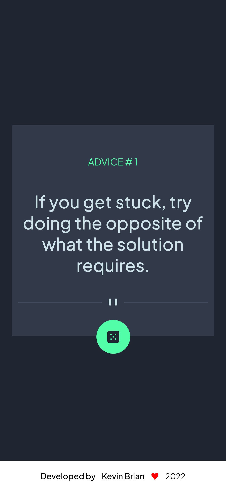

# Frontend Mentor - Advice generator app solution
.

## Table of contents
## Overview

### The challenge

Users should be able to:

- View the optimal layout for the app depending on their device's screen size
- See hover states for all interactive elements on the page
- Generate a new piece of advice by clicking the dice icon

### Screenshot

**Note: Delete this note and the paragraphs above when you add your screenshot. If you prefer not to add a screenshot, feel free to remove this entire section.**

### Links

- Solution URL: [https://github.com/realkevinbrian/AdviceMeApp](https://github.com/realkevinbrian/AdviceMeApp)
- Live Site URL: [Add live site URL here](https://your-live-site-url.com)

## My process

### Built with

- React
- Styled Components
- Flexbox
- CSS Grid

**Note: These are just examples. Delete this note and replace the list above with your own choices**

### What I learned

In this project, I learned more about API, Improving my styling Knowlegde.

### Continued development

- I am planning to add translator to different Languages

### Useful resources

- [Styled Components](https://www.example.com) - This helped me for styling my components. I really liked this pattern and will use it going forward.

- [Advice Slip API](https://www.example.com) - This is an amazing Advice API which helped me finally understand how API work. I'd recommend it to anyone still learning this concept.

## Author

- Website - [realkevinbrian.netlify.app](https://realkevinbrian.netlify.app)
- Frontend Mentor - [@realkevinbrian](https://www.frontendmentor.io/profile/realkevinbrian)
- Twitter - [@@realkevinbrian](https://twitter.com/realKevinBrian)

